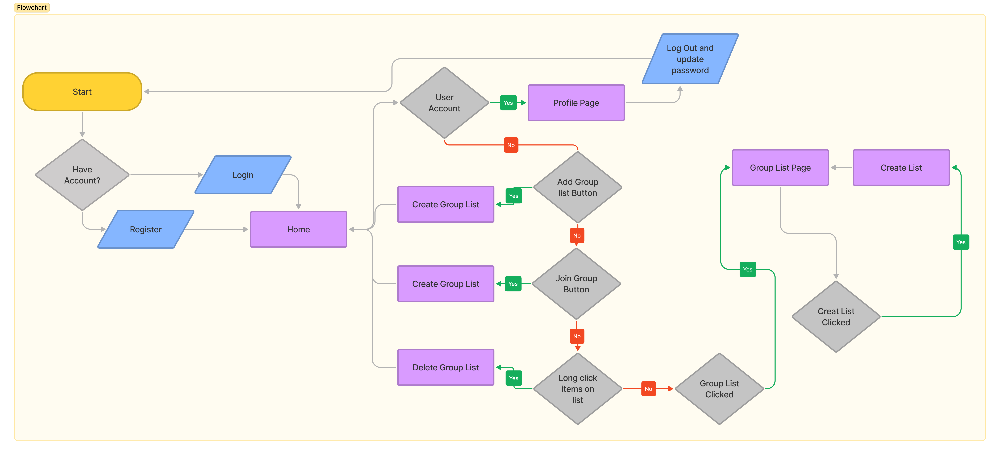
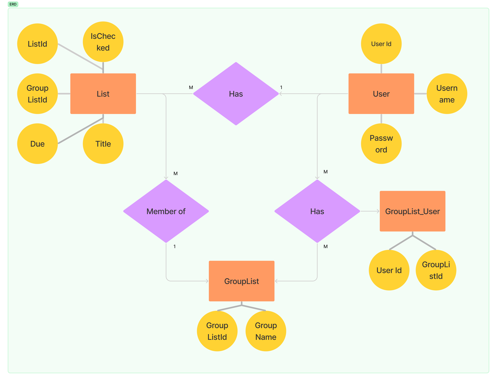

# Collaborative-Todo-List

TODO TOGETHER is an app that help people to remember what are they doing. This app has main feature to fill this todo together or collaborative


## Acknowledgements

 - [API Documentation](https://documenter.getpostman.com/view/18429728/UzBmMn11)


## Run Locally for Backend

Clone the project

```bash
  git clone https://github.com/Teenjb/Collaborative-Todo-List
```

Go to the project directory

```bash
  cd backend
```

Install dependencies

```bash
  npm install
```

Start the server

```bash
  npm run start
```

## Flowchart


## Flowchart


## Authors

- [@Teenjb](https://github.com/Teenjb)

